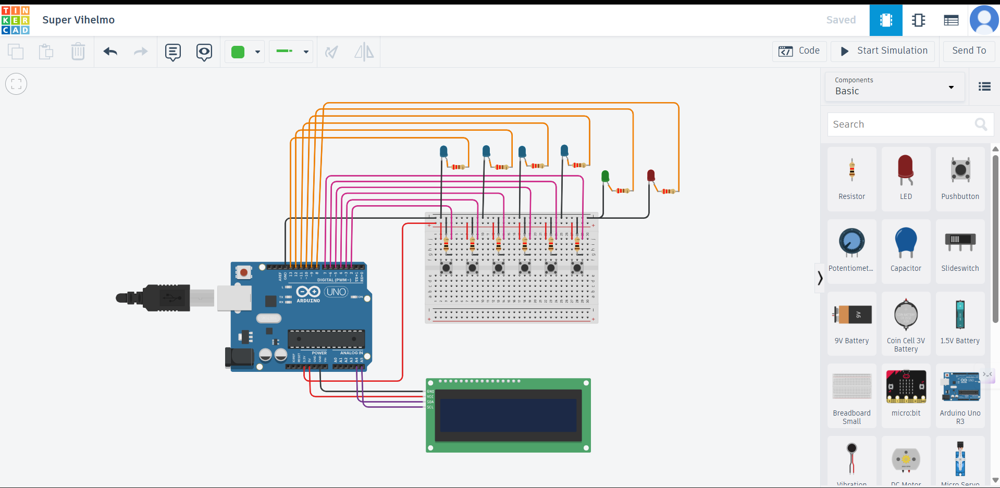

Project Name : Arduino EVM System

This project is an Arduino-based Electronic Voting Machine (EVM) that uses five push buttons and a 16×2 LCD to simulate a simple voting system. Four buttons are assigned to different parties, and each press records a vote and confirms it using an LED indicator. The LCD continuously displays the live vote count for all parties. A separate result button calculates the total votes, identifies the winning party, and shows the final result on the display. The system also handles tie cases and no-vote situations. After displaying the result, all counters reset automatically so the voting process can start again.

Tech Stack : 
C Programming  ,
Arduino UNO  ,
16x2 LCD Display  ,
Push Buttons ,
LEDs  ,
Tinkercad (for simulation)

Features  :
Four buttons assigned to different parties  ,
 LED indicator confirms vote submission  ,
 16x2 LCD displays live vote count  ,
 Result button calculates total votes  ,
 Identifies and displays winning party  ,
 Automatic reset after displaying result  ,
 Handles no-vote condition

 ## Screenshot

 How to Run the Project  :
 Open the Tinkercad link provided  ,
Start Simulation  , 
Press buttons to cast votes   ,
Press result button to display winner
